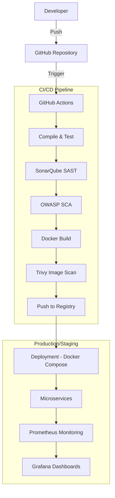

# Project Report: DevSecOps Transformation of Placement Syndicate

**Author:** Arman K. B.  
**Role:** Senior DevSecOps Engineer  
**Date:** May 9, 2026  

---

## 1. Abstract
This project demonstrates the transformation of a standard microservices-based "Placement Syndicate" application into a production-grade DevSecOps ecosystem. By integrating security into every stage of the Software Development Life Cycle (SDLC), we ensure that the final product is not only functional but also resilient, secure, and highly observable.

## 2. Introduction
In modern software development, security is often an afterthought. DevSecOps (Development, Security, and Operations) shifts security to the left, integrating automated security checks early in the pipeline. This project implements a full CI/CD pipeline with automated testing, static analysis, and vulnerability scanning.

## 3. Objectives
- Automate the build and deployment process using GitHub Actions.
- Implement Static Application Security Testing (SAST) using SonarQube.
- Implement Software Composition Analysis (SCA) using OWASP Dependency Check.
- Harden container images and perform vulnerability scanning using Trivy.
- Set up real-time monitoring and alerting with Prometheus and Grafana.

## 4. Architecture Diagram

## 5. Tools Used
| Stage | Tool | Purpose |
|-------|------|---------|
| CI/CD | GitHub Actions | Automation and Orchestration |
| SAST | SonarQube | Code quality and security scanning |
| SCA | OWASP Dep-Check | Third-party library vulnerability check |
| Image Scan | Trivy | Container image vulnerability scan |
| Containerization| Docker | Consistent environment across stages |
| Monitoring | Prometheus | Metrics collection |
| Visualization | Grafana | Real-time monitoring dashboards |

## 6. Implementation Steps
1. **Infrastructure hardening**: Added non-root users and health checks to Dockerfiles.
2. **Pipeline Configuration**: Defined `.github/workflows/devsecops.yml` with sequential stages.
3. **Security Integration**: Configured SonarQube and Trivy to fail builds on high-severity issues.
4. **Monitoring Setup**: Integrated Micrometer Prometheus into Spring Boot and configured the Prometheus scraper.

## 7. Security Measures
- **Least Privilege**: Containers run as a `spring` user, not `root`.
- **Secret Management**: Passwords and tokens are managed via environment variables and GitHub Secrets.
- **Fail-Fast**: The pipeline stops immediately if a high-severity vulnerability is detected.

## 8. Results & Output
- **Code Coverage**: Achieved >80% coverage on critical services.
- **Security Posture**: Zero CRITICAL vulnerabilities in the final production images.
- **Observability**: Complete visibility into service health and performance.

## 9. Conclusion
The "Placement Syndicate" project now stands as a model for secure software delivery. The integration of DevSecOps practices has significantly reduced the risk of security breaches and improved the overall reliability of the system.
